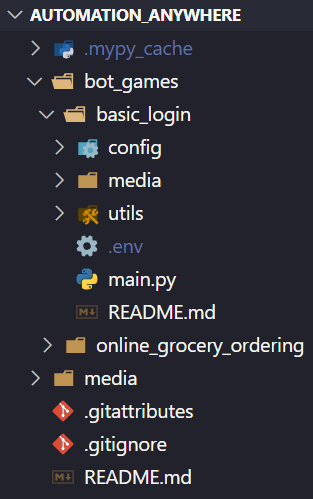

# **automation-anywhere**

## This repository is dedicated to solving **Automation Anywhere** challanges, like **bot games**.

*Note: I'm using Python 3.13.0.*

## **Repository Structure**

- automation_anywhere/ -> *repository folder*
  - bot_games/ -> *bot games challanges*
    - various_folders/ -> *challanges solutions*

### Each challange has its **own README.md** file that will give more informations about it and its solution.

### **Example:**
  

*I'm still deciding how to structure this repository, so be aware it may change.*
