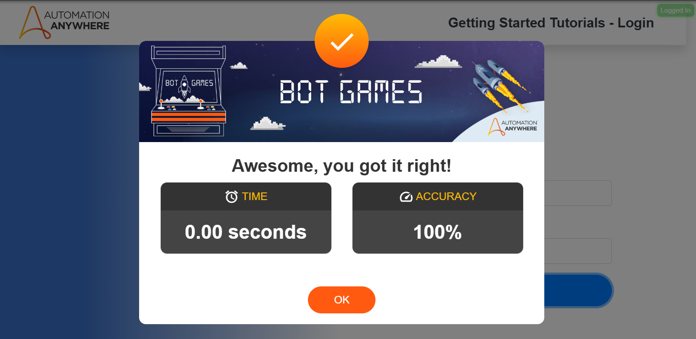

# Basic Login

My first automation anywhere challange, it's a simple login form. I choosed selenium for the automation.
A .env file was used to store community login credentials so create one youself before running the main.py file.

## Solution Structure

- basic_login/
  - media/ -> *Images for README*
  - main.py -> *Main file*
  - README.md -> *Documentation*

## Solution Review

"I choosed Selenium because is a great tool for robotic process automation on websites, and it
helped me with this login form.
After thinking about how I wanted to structure the folders and files for this project, I started
by creating and documenting a utils file that contains the functions I normally use to make clicking,
writing, and finding WebElements in Selenium easier.

Next, I mapped out all the locators I needed and created a config file to store them for easy access and better readability.
Last but not least, I structured the main file and tested everything as a whole. Throughout the process, I used Jupyter’s interactive terminal to test each step, which really helped me figure out how to code things efficiently."

— *Luca Agostinho Bendasoli Silva (Myself)*


## Results



---

## Challange:

A great place to start for anyone new to Automation Anywhere development. Many web applications
used by bots require some sort of login - in this challenge page, developers are asked to do
exactly that - just process a login.

Correctly fill in the username, password, and click submit for the scoring modal to appear.


Username: user@automationanywhere.com

Password: Automation123

---

***WebSite:***

\```https://pathfinder.automationanywhere.com/challenges/AutomationAnywhereLabs-Login.html?_gl=1*1hchg56*_gcl_au*ODc5NjQ2NDEwLjE3Mzk4NDg1MDI*_ga*MTc3NzI0MTUwMi4xNzM5ODQ4NTAz*_ga_DG1BTLENXK*MTczOTg0ODUwMi4xLjAuMTczOTg0ODUwNS41Ny4wLjE0NjE5MTYwMDg.
\```